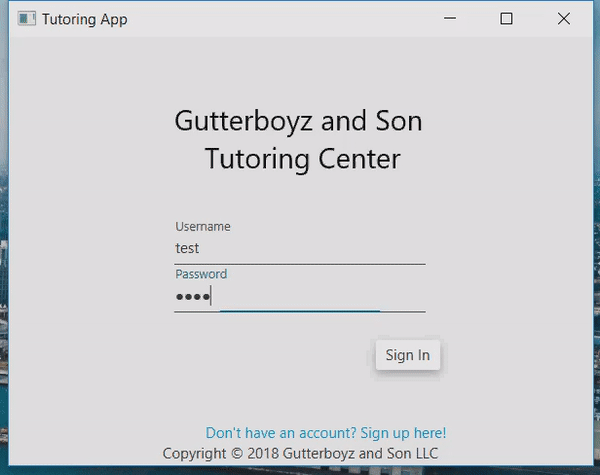

## GutterBoyz & Son Tutor Center
This project is a mock tutoring center application utilizing JavaFX and JSON
This project was created as a collaboration between Hunter Danielson, Carlos Reyes, Brian Withrow, Tomas Vergara, and Martin Marks.
This project was started in September 2018 and finished Dec 3, 2018. We are all currently learning Object Oriented Programming and Software Engineering Fundamentals.
The project was an assigned application for Soft. Eng. Fundamentals, and as a group we decided that we had best understanding of this application's requirements as practice.
The project was worked on individually by the group members outside of the classroom exclusively and at times in group efforts.
The project was also an experiment into learning more details about GUI, JSON, and project structure.

### Installation

#### JAR: 
You can download our project from github with this link https://github.com/GutterboyzSon/TutoringCenter.  
Next extract the project.   
Next navigate to the folder to find the project.   
Run the TutoringCenter.JAR file.  
#### Intelij:
You can download the zip for our program on GitHub here, https://github.com/GutterboyzSon/TutoringCenter.  
After extraction you can open the IntelliJ IDE, and use the “Open” option on the main screen. Navigate to the extraction folder with all the program folders in it,  and open it.  
Go to File>Project Structure>Modules>Dependencies,  
If there are any dependencies that are highlighted in red,  you can remove them with the subtraction button.  
Add the dependencies by pressing the + button and add the JARs (controlsfx-8.40.14.jar, jfoenix-8.0.7.jar, json-simple-1.1.1.jar) from the Libraries folder.  
Then click “Apply”.

### Getting Started
To start our project, please-
[Ideally we add a runnable jar for the use of our final deliverable and for this section]

### Built with:
Intellij  
JSON library  
JavaFX  
JFoenix  
Scenebuilder

### Contributing:
Help us with our functionality!  
We'd love to see better additions into our assignment format, and our calendar!

### License:
[MIT License](https://github.com/GutterboyzSon/TutoringCenter/blob/master/LICENSE)

### Acknowledgements:
Big thanks to:  
Oracle/Ilearning  
Chelsea Atkins, Fundamentals TA  
Stackoverflow  
JFoenix  
Prof. Vanselow  
Prof. Koufaku  

### Key Programming Concepts Utilized:
For the sake of our hierarchy, we used inheritance to help structure controller classes and their functions.  
